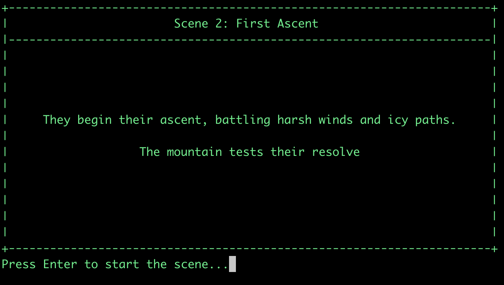
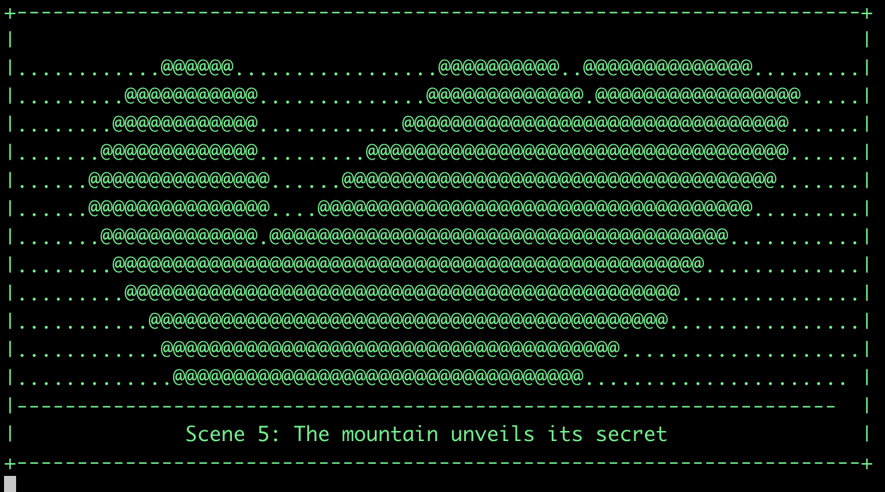

# Ascii Theater

## Overview
Ascii Theater is a Python-based project that creates and displays animated ASCII art movies. It uses AI to generate a story, converts the story into ASCII art frames, and then plays these frames in a command-line interface, creating a unique animated movie experience.




## Features
- AI-powered story and scene generation using OpenAI or local LLM (Ollama)
- Conversion of story scenes into ASCII art frames
- Command-line ASCII art movie player with scene information display
- Customizable frame rate for playback
- Movie selection interface for playing existing movies

## Prerequisites
- Python 3.7+
- OpenAI API key (for story generation using OpenAI)
- Ollama (for local LLM support)

## Installation

```console
  .
  ├── LICENSE
  ├── README.md
  ├── data
  │   └── movies
  │       ├── cosmic_voyage
  │       ├── crash_landing_a_robots_journey
  │       ├── debug_output
  │       ├── journey_beyond_the_stars
  │       ├── magic_awakening
  │       └── the_quest_for_the_shattered_ring
  ├── requirements.txt
  ├── scripts
  │   ├── generate_movie.py
  │   └── play_movie.py
  └── src
      ├── __init__.py
      ├── frame_generator.py
      ├── llm_config.py
      ├── movie_player.py
      ├── story_generator.py
      └── utils.py
```

1. Clone the repository:
```
   git clone https://github.com/jmcdice/ascii-movie-project.git
   cd ascii-movie-project
```

2. Install the required dependencies:
```
   python -m venv .venv
   python3 -m venv .venv
   source .venv/bin/activate
   pip install -r requirements.txt
```

3. Set up your LLM config's, copy the example env and fill it in
```
   cp .env_example .env.sh
```

4. Install Ollama (if using local LLM):
   - Follow the instructions at [Ollama's official website](https://ollama.ai/download)

## Usage

### Generating and Playing Movies

To generate a new ASCII art movie, use the generate_movie.py script. You can specify the LLM provider and an optional topic for the movie.
Examples:

Using Anthropic's Claude:
```
  python scripts/generate_movie.py --provider anthropic --topic "Space exploration"
```

Using OpenAI's GPT model:
```
  python scripts/generate_movie.py --provider openai --topic "Underwater adventure"
```

Using local Ollama model:
```
  python scripts/generate_movie.py --provider ollama --topic "Time travel"
```

### Playing a Movie

To play a generated ASCII art movie, use the play_movie.py script. This script will list available movies and allow you to choose one to play.

```
  python scripts/play_movie.py
```

Example output:
```
  Available movies (most recent first):
  
  1. journey_beyond_the_stars
  2. cosmic_voyage
  3. crash_landing_a_robots_journey
  4. magic_awakening
  5. the_quest_for_the_shattered_ring
  
  Enter the number of the movie you want to play (or 'q' to quit):
```

You can also adjust the frame delay and scene delay:
```
  python scripts/play_movie.py --delay 0.5 --scene-delay 3
```

## Contributing

Contributions to the ASCII Movie Generator and Player are welcome! Please feel free to submit a Pull Request.

## License

This project is licensed under the MIT License - go nuts. 

